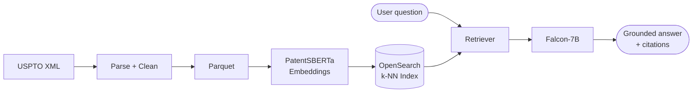

# Patent Research Assistant

Retrieval-Augmented Generation (RAG) over USPTO full-text patent grants —
ask a natural-language question, get an answer grounded in and cited to
real patents.

## Overview

The Patent Research Assistant ingests USPTO bulk patent-grant XML, converts
it into semantic embeddings with a patent-domain language model
(PatentSBERTa), indexes those embeddings for k-NN similarity search in
OpenSearch, and answers user questions by retrieving the most relevant
patents and passing them as grounding context to an LLM (Falcon-7B-Instruct
by default). A lightweight web UI provides natural-language and voice
search, with light/dark themes and email-based authentication.



See [docs/ARCHITECTURE.md](docs/ARCHITECTURE.md) for full sequence/topology
diagrams and a module-by-module breakdown.

## Features

- Natural-language patent search with citations back to source patents
- Voice search (Web Speech API) and dark/light theme, no page reload
- Email sign-up / login backed by Amazon Cognito
- Vector similarity search over patent titles, abstracts, and claims
- Event-driven indexing: drop a new XML dump in S3 and it's searchable
  within minutes, no manual re-index step
- Fully parameterized offline pipeline: no hardcoded local paths, runs
  identically on a laptop or in Lambda

## Tech stack

| Layer | Technology |
|---|---|
| Frontend | HTML, CSS, vanilla JS, Bootstrap 5 |
| API | Amazon API Gateway (HTTP API) |
| Compute | AWS Lambda (Python 3.11) |
| Vector store | Amazon OpenSearch (k-NN) |
| Embeddings | PatentSBERTa (`sentence-transformers`) |
| Generation | Falcon-7B-Instruct (SageMaker / HF Inference / Bedrock) |
| Orchestration | LangChain (`langchain-core` retriever interface) |
| Auth | Amazon Cognito |
| Storage | Amazon S3 (raw XML + static frontend hosting) |
| IaC | AWS SAM (`infra/template.yaml`) |

## Repository structure

```
Patent-Research-Assistant/
├── README.md
├── docs/
│   └── ARCHITECTURE.md          # Detailed diagrams + module map
├── data_processing/              # Offline ingestion pipeline (CLI, no hardcoded paths)
│   ├── download_to_s3.py         # USPTO bulk data -> S3
│   ├── xml_splitter.py           # Concatenated dump -> individual XML docs
│   ├── xml_validator.py          # Well-formedness check
│   ├── xml_parser.py             # Shared cleaning + structured field extraction
│   ├── xml_to_parquet.py         # Structured records -> Parquet
│   ├── build_embeddings.py       # Parquet -> embeddings -> OpenSearch (batch)
│   └── view_parquet.py           # Inspect parquet output
├── backend/
│   ├── config.py                 # Env-driven configuration
│   ├── rag/
│   │   ├── embeddings.py         # PatentSBERTa wrapper
│   │   ├── opensearch_client.py  # Index mgmt + k-NN search
│   │   ├── retriever.py          # LangChain retriever
│   │   ├── llm.py                # Falcon-7B generation (pluggable backend)
│   │   └── chain.py              # End-to-end RAG chain
│   └── handlers/
│       ├── search_handler.py     # POST /search
│       ├── indexing_handler.py   # S3 event -> parse + embed + index
│       └── auth_handler.py       # POST /auth/{signup,confirm,login}
├── frontend/
│   ├── index.html                # Search UI
│   ├── signup.html / login.html  # Auth UI
│   ├── css/styles.css
│   └── js/{app,auth,config}.js
├── infra/
│   ├── template.yaml             # AWS SAM stack (S3, OpenSearch, Cognito, Lambdas, API)
│   └── opensearch_index_mapping.json
├── scripts/
│   └── run_local_pipeline.sh     # split -> validate -> parquet -> embed, one command
├── notebooks/                    # Historical bulk-download notebooks (1971-2000)
├── schemas/
│   └── us-patent-grant-v45-2014-04-03.dtd
├── requirements.txt
└── .env.example
```

## Quickstart: local pipeline (no AWS required for parsing/embeddings)

```bash
python -m venv .venv && source .venv/bin/activate
pip install -r requirements.txt
cp .env.example .env   # fill in OPENSEARCH_ENDPOINT etc. if you have a cluster

# End-to-end: split -> validate -> parquet -> embed + index
./scripts/run_local_pipeline.sh /path/to/ipg231226.xml ./data

# Ask a question against the index you just built
python -m backend.rag.chain "What patents describe solid-state battery electrolytes?"
```

Each stage can also be run independently, e.g.:

```bash
python -m data_processing.xml_splitter --input ./ipg231226.xml --output-dir ./data/split
python -m data_processing.xml_validator --input-dir ./data/split
python -m data_processing.xml_to_parquet --input-dir ./data/split --output-dir ./data/parquet
python -m data_processing.build_embeddings --parquet-dir ./data/parquet
python -m data_processing.view_parquet --path ./data/parquet
```

## Quickstart: deploy the full AWS stack

Requires the [AWS SAM CLI](https://docs.aws.amazon.com/serverless-application-model/latest/developerguide/install-sam-cli.html)
and an AWS account.

```bash
cd infra
sam build
sam deploy --guided
```

`sam deploy` prints outputs including `ApiBaseUrl`, `RawDataBucketName`, and
`CognitoUserPoolId`. Then:

1. Paste `ApiBaseUrl` into `frontend/js/config.js`.
2. Sync the frontend: `aws s3 sync ../frontend s3://<FrontendBucketName>`.
3. Upload a USPTO bulk XML file to `s3://<RawDataBucketName>/uspto/fulltext/` —
   `IndexingFunction` fires automatically and indexes it.
4. Deploy Falcon-7B-Instruct to a SageMaker real-time endpoint (or point
   `LLM_PROVIDER=huggingface` at the HF Inference API for a no-GPU option),
   and set `SAGEMAKER_ENDPOINT_NAME` accordingly.

## API reference

| Route | Method | Body | Response |
|---|---|---|---|
| `/search` | POST | `{"query": "..."}` | `{"answer": "...", "sources": [{"patent_id", "title", "publication_date", "relevance_score"}]}` |
| `/auth/signup` | POST | `{"email", "password"}` | `{"message": "..."}` |
| `/auth/confirm` | POST | `{"email", "code"}` | `{"message": "..."}` |
| `/auth/login` | POST | `{"email", "password"}` | `{"access_token", "id_token", "refresh_token", "expires_in"}` |

## Configuration

All configuration is environment-driven — see [.env.example](.env.example)
for the full list (AWS region/bucket, OpenSearch endpoint, embedding model,
LLM provider/model, retrieval `top_k`, Cognito pool/client).

## Roadmap

- [ ] Citation-graph enrichment (patent-to-patent reference graph)
- [ ] Inventor/assignee network analysis surfaced in the UI
- [ ] Swap OpenSearch for a managed vector DB behind the same retriever interface
- [ ] Add automated tests around `data_processing.xml_parser`

## Contributing

1. Fork the repository
2. Create a feature branch
3. Commit your changes
4. Push to the branch
5. Open a Pull Request

## License

MIT License — see [LICENSE](LICENSE).
