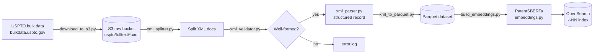
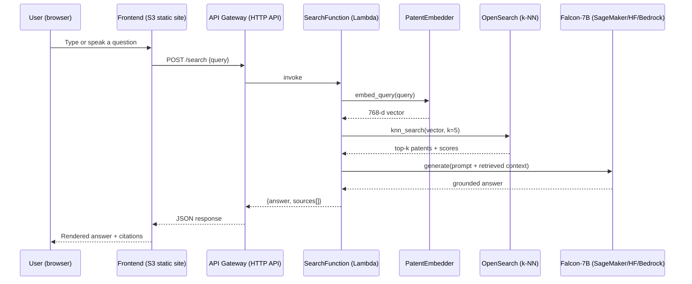
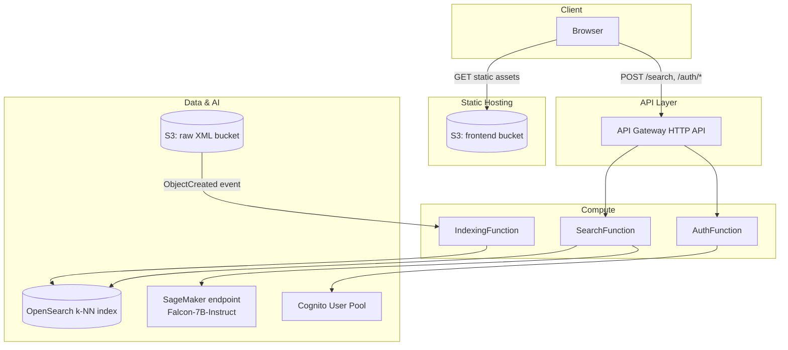

# Architecture

## 1. Offline ingestion & indexing pipeline

Turns raw USPTO bulk XML into a searchable vector index. Runs either as a
one-off local batch (`scripts/run_local_pipeline.sh`) or continuously via
the S3-triggered `IndexingFunction` Lambda.

## 2. Query-time RAG flow

## 3. Deployed AWS topology

## Module map

| Layer | Path | Responsibility |
|---|---|---|
| Ingestion | `data_processing/download_to_s3.py` | Pull USPTO bulk-data zips/XML, upload to S3 |
| Ingestion | `data_processing/xml_splitter.py` | Split concatenated multi-patent dumps into individual docs |
| Ingestion | `data_processing/xml_validator.py` | Well-formedness check before parsing |
| Ingestion | `data_processing/xml_parser.py` | Shared XML cleaning + structured field extraction |
| Ingestion | `data_processing/xml_to_parquet.py` | Structured records -> partitioned Parquet |
| Ingestion | `data_processing/build_embeddings.py` | Parquet -> PatentSBERTa embeddings -> OpenSearch (batch) |
| RAG core | `backend/rag/embeddings.py` | PatentSBERTa embedding wrapper (query + document) |
| RAG core | `backend/rag/opensearch_client.py` | Index management + k-NN search |
| RAG core | `backend/rag/retriever.py` | LangChain `BaseRetriever` over OpenSearch |
| RAG core | `backend/rag/llm.py` | Falcon-7B generation (HF Hub / SageMaker / Bedrock) |
| RAG core | `backend/rag/chain.py` | Prompt assembly + end-to-end `answer(question)` |
| API | `backend/handlers/search_handler.py` | `POST /search` |
| API | `backend/handlers/indexing_handler.py` | S3 `ObjectCreated` -> parse + embed + index |
| API | `backend/handlers/auth_handler.py` | `POST /auth/{signup,confirm,login}` via Cognito |
| Infra | `infra/template.yaml` | AWS SAM stack: S3, OpenSearch, Cognito, Lambdas, HTTP API |
| Frontend | `frontend/` | Static HTML/CSS/JS search UI + auth pages |

## Configuration

Every backend module reads its settings from `backend/config.py`, which in
turn loads environment variables (via `.env` locally, or Lambda environment
variables in `infra/template.yaml`). See `.env.example` for the full list.

## Why these choices

- **PatentSBERTa** over a general embedding model: fine-tuned on patent
  claims/abstracts, so it separates near-duplicate patent language better
  than `all-MiniLM`-style general models.
- **OpenSearch k-NN** over a managed vector DB: keeps everything inside the
  existing AWS account/IAM boundary and reuses infra the team already
  operates (no new vendor).
- **Falcon-7B-Instruct** behind a swappable `LLM_PROVIDER`: open-weights,
  commercially usable, and cheap to self-host on a single SageMaker GPU
  instance; swapping to Bedrock/another model is a one-line config change,
  not a code change.
- **Cognito** for auth instead of hand-rolled sessions: offloads password
  storage, verification codes, and JWT issuance to AWS.
